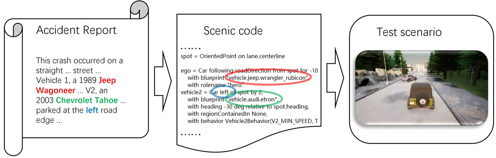

# ADEPT Part1 Generate Test Scenarios
ADEPT: A Testing Platform for Simulated Autonomous Driving

AutoDrivingVehicle model weights:
https://drive.google.com/file/d/15xqp_EnYQ83KmObBr7RTIHmICA4Wt__O/view?usp=sharing

## Introduction

Generation of Test Scenarios from Accident Reports. This engine takes a traffic accident report and translates the accident description (in natural language) to an intermediate representation (in a scenario-description language) for which we use Scenic. The Scenic-supplied tools can load the scene and connect to the ADS for testing at the same time. 

We leverage natural language processing aiming for automated translation of the accident report. Technically, we utilize a question-and-answer technique based on the question-answering system GPT-3. We define a set of questions as well as Scenic code templates. The report text and predefined questions are sent to GPT-3. Upon the response, we choose the template that corresponds to the accident report’s description from the predefined templates and fill in the template’s important missing information. Specifically, we inquire about the location of the collision (including whether it occurred at a three-way, four-way, or non-intersection), the time, the weather, and the relative position relationship between the two cars involved (including the left-right relationship of the lane, the front-to-back relationship of the distance, etc. ).

The figure shows an example. A customized GPT-3 extracts valuable information (e.g., number of cars, the Vehicle brand, the position, speed, and direction) from the accident description in natural language to generate a Scenic code. Then, the ADS test case is generated based on the Scenic code. Since Carla and Scenic do not support Chevrolet Tahoe, the tool randomly selects an Audi Etron as the vehicle 2 at this time.



## Usage

Step1: install Scenic

https://scenic-lang.readthedocs.io/en/latest/

https://pypi.org/project/scenic/

https://github.com/BerkeleyLearnVerify/Scenic


Step2: install CARLA

https://carla.readthedocs.io/en/latest/

**Note: Scenic has requirements for the Carla version.**


Step3: Download AutoDrivingVehicle model weights:
https://drive.google.com/file/d/15xqp_EnYQ83KmObBr7RTIHmICA4Wt__O/view?usp=sharing

If you are interested in the autonomous driving model, you can visit the original author's git repository.

https://github.com/valeoai/LearningByCheating


Step4:

(a)

```
python generate_test_scenic.py
```

Enter the accident report according to the prompt. Some accident reports can be found from Cases.txt, and each paragraph is a report.

(b)

```
scenic xxxxxxx.scenic
```

Start the test scenario.

(c)

```
python manual_control.py
```

Try to control the vehicle manually to experience the accident scenarios.

OR

```
python run.py
```

Run the self-driving software to make it drive in the scenarios.
