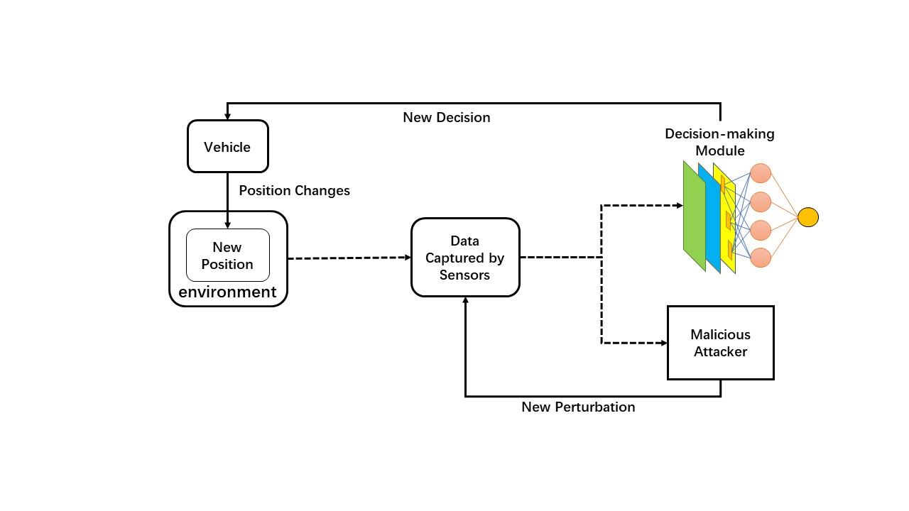
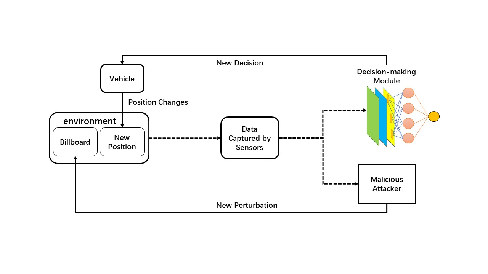
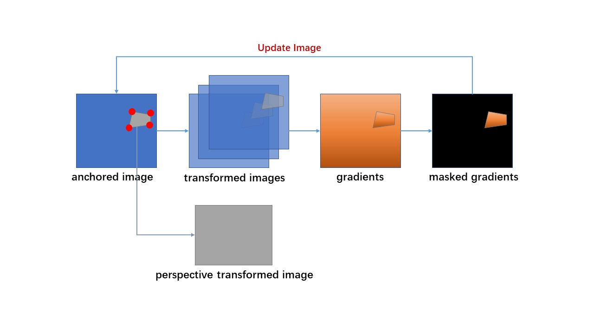

# ADEPT
ADEPT: A Testing Platform for Simulated Autonomous Driving

## Closed-loop Testing Based on Adversarial Attack
### Comparison with other methods

As is depicted in the figure above, our closed-loop method (upper) directly modifies the billboard physically instead of modifying the view of the ADS digitally (lower).

### Generation of robust AEs
Malicious Attacker Module (MAM) leverages the feedback to anchor itself from the view of the victim vehicle in order to conduct tailored attacks. With adversarial attack algorithms, MAM determines what to show in the next frame attempting to fool the victim vehicle in order to conduct tailored attacks. With adversarial attack algorithms, MAM determines what to show in the next frame attempting to fool the victim.

As is depicted in the figure above, we generate AEs more robust in the physical sense. We find, based on the observation of pixel shifts, that the color between the real pixel and the illustrated pixel of an RGB-camera-captured image can be captured by a nonlinear transformation. On the basis of pixel data collected from the testing platform, we employ a lightweight neural network to fit such a nonlinear transformation. Since the car's perspective does not change significantly during the victim vehicle's decision-making interval, factors caused by the moving state on our testing platform consist primarily of blur and minor changes in angle of view. Here, we resort to Expectation Over Transformation (EOT), which abstracts various transformations into distributions and embeds the transformations as the parallel preprocess of the input, then regards the expectation over all transformations as the ultimate optimized object, with each step of iteration accepting the input updated in the previous step. 

### Operation
- Baseline: No hijacking.
    
    `python run_no_hijacking.py`

- Hijack the victim to drive along the S-bend.

    `python run_S_bend.py`

- Hijack the victim to crash to collide with the pedestrian.

    `python run_collision_with_pedestrian.py`